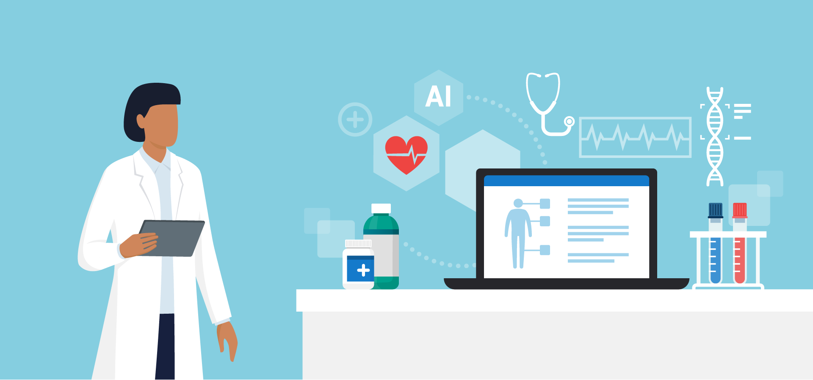

# Artifical Intelligence in Healthcare
## Author
- [@novotz](https://github.com/novotz)

## Details
After writing my bachelor's thesis on the potential of artificial intelligence in 
the health sector, I was curious to see how such projects could be implemented in 
practice and whether initial results could be achieved even with the simplest 
means. After a bit of research, I came across several datasets, from which I 
chose two to solve two different medical problems using Machine and Deep Learning.
The first project in this repository deals with the detection of breast cancer and
the second with the detection of diabetes. A more detailed description and 
introduction to the respective projects can be found in the subfolders. 

## Breats Cancer Detection
Click [here](breast_cancer_detection) to learn more about the breast cancer detection project.

## Diabetes Detection
Click [here](diabetes_detection) to learn more about the diabetes detection project.
